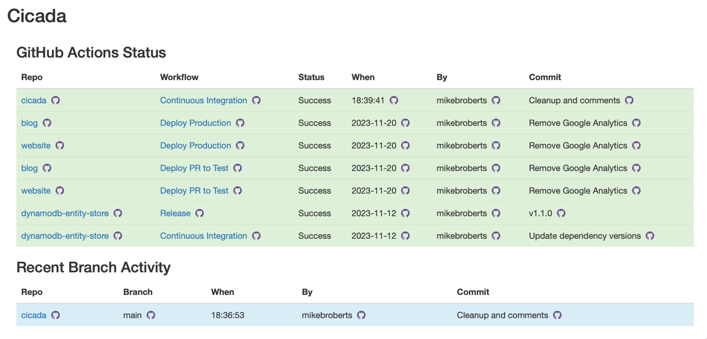
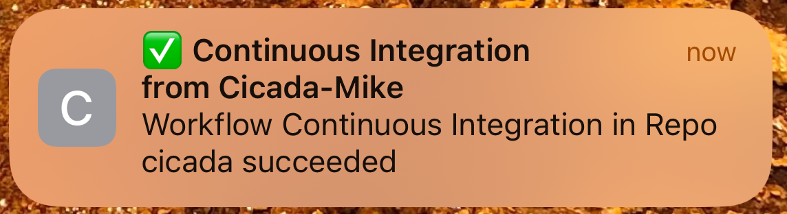

# Cicada

Hello, and welcome!

## What is Cicada?

Cicada is two things:

* A reasonably-sized example of a lot of techniques that can be used for building serverless applications with Amazon Web Services (AWS)
* A monitoring tool for GitHub and GitHub Actions

### Cicada as Example

Over the last few years I've helped several clients build applications on AWS. Each of these applications placed serverless techniques and
services at their core. In that time I've formed many opinions of good ways to code, architect, and operate such applications.

Cicada is an application that helps me demonstrate many of these opinions, including:

* Architecture - which services to use, and how to use them
* Coding - what techniques work well when writing TypeScript code that runs in Lambda functions
* Operations - how I think about using CDK and GitHub Actions when deploying something more significant than a "Hello World" app

I am writing about these recommendations, using Cicada as a living example, at https://blog.symphonia.io.
The parent article for this writing [is here](https://blog.symphonia.io/posts/2024-04-09_introducing-cicada).

### Cicada as App

I first used the technique of Continuous Integration (CI) over 20 years ago, and have spent many of the years in between
using and/or building CI and CD (Continuous Delivery or Continous Deployment) tools and processes. My current tooling preference for CI and CD
automation is GitHub Actions - however one of the areas I don't love about GitHub Actions is its UI - especially for notifications and cross-repository status.

Cicada is an application that you can attach to your GitHub account and use to get useful data about your GitHub Actions workflows, and other
Github activity.

Here is an example of Cicada's home screen:

This shows the status all of the GitHub Actions workflows in my account, as well as recently active branches.
I can drill into more detailed views for a repository, or an individual workflow, or I can navigate straight to
Github's own pages.

Cicada also provides realtime notifications to both desktop and mobile devices by way of _Web Push_ notifications.
This allows you to keep on top of what's going on in your GitHub Actions workflows.

Here's what a notification looks like on my iPhone:

## Setting up Cicada

See [Setting Up Cicada](docs/SettingUpCicada.md) for Setup instructions.

## Using Cicada

Cicada is a web-app, and the URL will be provided at the end of the [setup process](docs/SettingUpCicada.md).
When you visit this URL for the first time you'll be shown a welcome screen.

Now try logging in - click the "login with your GitHub user" link. You'll go through the GitHub login flow, and then eventually you'll end up at a screen that says "GitHub Actions Status".

> You have to be a member of the GitHub Account for which this installation of Cicada has been configured, otherwise you'll be denied access.

## Using Push Notifications

On each Cicada screen you'll see a "User Settings" link - choosing this will allow you to subscribe for notifications.

**IMPORTANT FOR IPHONE USERS** :
On an iPhone you need to "install" Cicada as a Progressive Web App (PWA) first - you do this by adding it to your home screen via the "share" button in Safari.
Open the PWA version of Cicada from your home screen and then you should be able to subscribe for notifications.

At the moment notifications are all-or-nothing - you'll get notified of all GitHub Actions Workflow runs in your account. Eventually I'd like to have this be more configurable.

## Licensing and Contributions

My primary goal for Cicada, for now, is providing a freely-available example of many of the techniques I use in my client work.
However, there is a chance that in future I may wish to offer a version of Cicada as a commercial product. This has the following impacts:

1 - The [license](LICENSE) is a "Source Available License", specifically the Business Source License (BSL). This license is used by several software products, originally MariaDB.
The license basically says (although refer to the license for the actual legal version) that you can use Cicada however you want, apart from selling any version (or derivative) of it as a product or service.

2 - I absolutely welcome contributions, but please be aware that I have a [Contributor Agreement](ContributorAgreement.txt) to make sure we're covered should I ever decide to productize it.